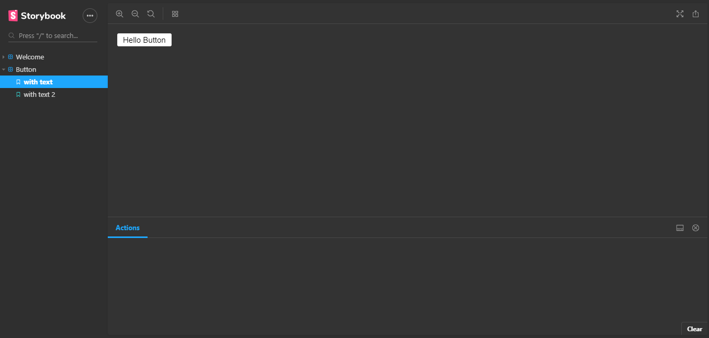
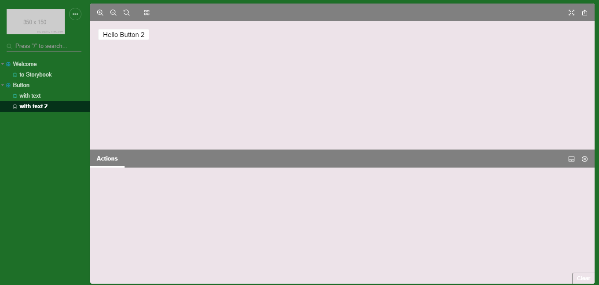

# What is

[StoryBook](https://storybook.js.org/) is a playgroung for build UI components in isolation, can you describe the state you will need to this component and build it isolated of the main context.
The next steps will show the first steps to use storybook, a bit more then "Hello World".

# Good to
* Build really reusable components;
* Test components;
* Catalog the components of your project (good for big teams);
* Less cascade development (tasks waiting something be done to begin).

# Installing

Storybook can be used with many libraries like Angular, Ember, Vue, etc.. but now i will use for React.

Inside your project folder root:
```javascript
npx -p @storybook/cli sb init
```
Storybook will check your package.json to determine library are you using, to be sure of what kind will be installed, include type:
```javascript
npx -p @storybook/cli sb init --type react
```

*Manutal installing:*
```javascript
npm install @storybook/react --save-dev
npm install react react-dom --save
npm install babel-loader @babel/core --save-dev
```

Add this to `package.json`
```javascript
{
  "scripts": {
    "storybook": "start-storybook"
  }
}
```

After all, start Storybook:
```javascript
npm run storybook
```

# Writing stories

If have you done the automatically installation, you can see the file `storybook/config.js` if not let’s create a config file containing:
```javascript
import { configure } from '@storybook/react';

function loadStories() {
  require('../stories/index.js');
}

configure(loadStories, module);
```

Here is where we will call our stories, each story has a component, again, if you dont have the `stories/index.js` go to create:
```javascript
import React from 'react';
import { storiesOf } from '@storybook/react';
import { Button } from '@storybook/react/demo';

storiesOf('Button', module)
  .add('with text', () => (
    <Button>Hello Button</Button>
  ))
  .add('with text 2', () => (
    <Button>Hello Button 2</Button>
  ));
```

The `storiesOf` is the begining of the component, the `.add()` we use to add each state, this use two arguments, the name of state and the function with the return.

It's everything you need to start building and testing your components with Storybook.

# Theming

Personaly i prefer the dark theme in my editors and tools, Storybook has a dark theme to, at `storybook/config.js` import:
```javascript
import { addParameters } from '@storybook/react';
import { themes } from '@storybook/theming';
```

and after add parameters:

```javascript
addParameters({
  options: {
    theme: themes.dark,
  },
});
```

Now you should see something like:


# Custom

You can edit the Storybook style to fit with your project, create a file `myTheme.js` and paste the code below:

```javascript
import { create } from "@storybook/theming";

export default create({
  base: "dark",

  colorPrimary: "seagreen",
  colorSecondary: "#053219",

  // UI
  appBg: "#1e6f28",
  appContentBg: "#ede3e9",
  appBorderColor: "grey",
  appBorderRadius: 4,

  // Typography
  fontBase: '"Open Sans", sans-serif',
  fontCode: "monospace",

  // Text colors
  textColor: "white",
  textInverseColor: "rgba(255,255,255,0.9)",

  // Toolbar default and active colors
  barTextColor: "white",
  barSelectedColor: "white",
  barBg: "gray",

  // Form colors
  inputBg: "white",
  inputBorder: "silver",
  inputTextColor: "white",
  inputBorderRadius: 4,

  brandTitle: "My custom storybook them",
  brandUrl: "https://gianw.github.io/",
  brandImage: "https://placehold.it/350x150"
});
```

Now update `config.js`
```javascript
import { configure } from '@storybook/react';
import { addParameters } from '@storybook/react';

import myTheme from "./myTheme";

addParameters({
  options: {
    theme: myTheme,
  },
});

```



that's all for while.